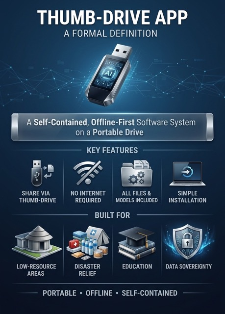

# Thumb Drive App (TDA)

- A new way to deploy portable self-contained AI software in low resource settings.
- Bundle all binary executables, including Ollama, together with the app.
- Runs offline.
- Double-click a file to install.
- Runs in a virtual environment.

 

 

Yes, I know this approach looks old-school. But it works effectively. Try it by downloading and installing the example app.

 

## Modern AI software installation

- Install Ollama
- Download models from HuggingFace
- Download code from GitHub
- Run pip install requirements.txt

## Why this doesn't work in low resource settings

- No internet or internet is very slow
- Internet connection is unstable
- Internet data plans are expensive

## Solution - The Thumb-Drive App

- Ollama, the Models and all dependencies are downloaded together
- Installation doesn't require an internet connection
- Double-click a file to install and run
- App runs completely offline
- Entire app can be shared on a thumb-drive, via AirDrop or over a local network

 

## Working Example - The Offline MedAi Console v2.0 TDA

The Offine MedAi Console is an AI collaborator for clinicians. It's a transparent, offline-first and privacy-first multimodal AI console where clinicians can talk, type, show images, adjust parameters and create AI tools. Uses Flask for the backend, Whisper for Speech-to-Text (STT), Kokoro for Text-to-Speech (TTS), and Ollama to serve the Large Language Model (LLM). It's designed to run on Apple Silicon computers.

I originally built version 1 of this console as my entry for a Medical AI hackathon on Kaggle. I've converted version 2 into a Thumb-Drive app. All dependencies including Ollama and the MedGemma 4b BF16 model are bundled with the app. Total size is approximately 10.2 GB. No internet is needed for installation. The app can be shared using a thumb drive or via AirDrop.

 

## Version 1.0

YouTube Video - Demo 
https://www.youtube.com/watch?v=X3-6MpZp89s

Kaggle Writeup - The MedGemma Impact Challenge 
https://www.kaggle.com/competitions/med-gemma-impact-challenge/writeups/offline-medai-console

GitHub 
https://github.com/vbookshelf/Offline-MedAi-Console

## Changes made in v2.0

- All dependencies, including Ollama and the MegGemma model, have been bundled together (10 GB)
- Installation can be done offline
- User double clicks a file to install and run
- Entire app  can be shared on a thumb drive
- Code is stored in this dataset and not on GitHub because GitHub has a file size limit

## System Requirements:

- Operating System: MacOS
- Computer: Apple Silicon Mac (M Series)
- RAM: 16GB
- Free disk Space: 10 GB

## Installation Instructions

 
